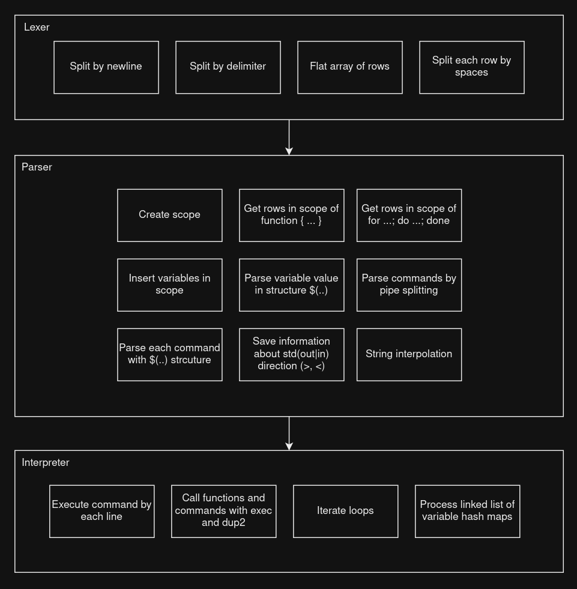

# Интерпретатор Bash

### Дизайн



#### Лексер

- Разбиваем на отдельные команды:
  - делаем split по переводящиму символу (`\n`);
  - делаем split по отделяющему символу (`;`);
  - собираем единый массив;
- Каждую строку разбиваем на токены по пробельным символам (`isspace`).
- Получаем массив массивов

#### Парсер

Мы проходимся по массиву массивов. Начинаем рекурсивно разбирать каждый массив по следующему принципу:
1) Если массив содержит лексему =, то это присваивание. Рекурсивно запускаем для левой и правой от = части. Создаем структуру «variable”, и кладем результаты рекурсивных вызовов в поле Execute
2) Если массив содержит |, то это пайп. Рекурсивно запускаем для левой и правой от | части. Создаем структуру pipe и кладем результаты рекурсивных вызовов в execute.
3) Если лексема одна, и она заключена в кавычки, то это литерал. Возвращаем структуру literal
4) Если массив содержит $, то это интерполяция. Создаем структуру интерполяции.
5) Если 1-3 неверно, то это команда. Рекурсивно запускаем для каждой лексемы, кроме первой. Создаем структуру команды, и кладем результаты рекурсивных вызовов в поле Exexute.

После любого из 1-5, возвращаем структуру.

По результатам парсинга получаем лексическое дерево.

#### Интерпретатор
Интепретатор поиском в глубину обходит дерево. Его цель - стянуть дерево в литерал.
1) Если текущая структура - =, рекурсивно проходим дальше и на обратном пути заменяем пустым литералом.
2) Если пайп, проходимся по массиву execute, исполняя каждый и передавая результат на вход следующим. Результат исполнения последнего элемента execute сохраняем в литерал и возвращаем.
3) Если интерполяция, проходимся по массиву execute, конкатенируя результаты исполнения в итоговый литерал.
4) Если литерал, то возвращаем литерал.

#### Пример

```bash
VAR1="VALUE"
VAR2="VALUE OF VAR1=$VAR1 $(echo 'echo')"
cat "./$VAR1" | wc -l | pwd | echo "SOME"
```

```python
tree = [
    {
        "type": "variable",
        "name": "VAR1",
        "exectute": [
            {
                "type": "literal",
                "value": "VALUE",
            }
        ]
    },
    {
        "type": "variable",
        "name": "VAR2",
        "execute": [
            {
                "type": "interpolation",
                "execute": [
                    {
                        "type": "literal", 
                        "value": "VALUE OF VAR1="
                    },
                    {
                        "type": "variable",
                        "name": "VAR1",
                    },
                ]
            },
        ]
    },
    {
        "type": "pipe",
        "execute": [
            {
                "type": "command",
                "execute": [
                    {
                        "type": "literal",
                        "value": "cat",
                    },
                    {
                        "type": "interpolation",
                        "execute": [
                            {
                                "type": "literal",
                                "execute": "./",
                            },
                            {
                                "type": "variable",
                                "name": "VAR1",
                            }
                        ]
                    }
                ]
            },
            {
                "type": "command",
                "execute": [
                    {
                        "type": "literal",
                        "value": "wc",
                    },
                    {
                        "type": "literal",
                        "value": "-l",
                    },
                ]
            },
            {
                "type": "command",
                "execute": [
                    {
                        "type": "literal",
                        "value": "pwd",
                    },
                ]
            },
            {
                "type": "command",
                "execute": [
                    {
                        "type": "literal",
                        "value": "echo",
                    },
                    {
                        "type": "literal",
                        "value": "SOME",
                    },
                ]
            },
        ]
    }
]

```

### Состав

```text
Гостило Роман
Смородский Артем
Куваев Максим
Косенко Алексей

Проект по System Design, 2024
```
